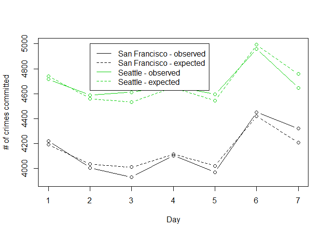
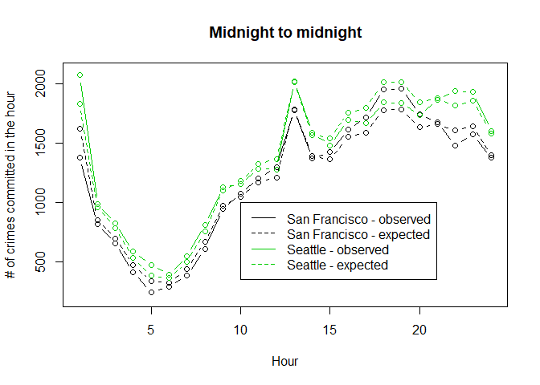
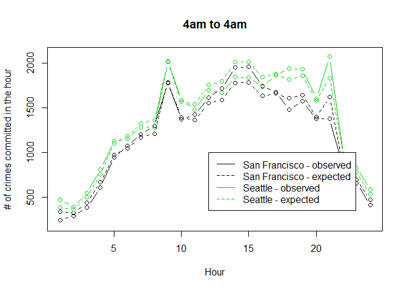

Data-Viz-Assignment
================
Ingrid Baade
April 16, 2018

Crime Analytics
---------------

Is day of the week when a crime occurs associated with city (San Francisco/ Seattle)? Is hour of the day when a crime occurs associated with city (San Francisco/ Seattle)?

``` r
SeattleData <- as_tibble(read.csv("seattle_incidents_summer_2014.csv"))
SanFranciscoData <- as_tibble(read.csv("sanfrancisco_incidents_summer_2014.csv"))

City <- rep(c("Seattle","San Francisco"),c(dim(SeattleData)[1], dim(SanFranciscoData)[1]))      
Date <- date(mdy_hms(SeattleData$Occurred.Date.or.Date.Range.Start))
Date <- append(Date, mdy(SanFranciscoData$Date))
Month <- SeattleData$Month
Month <- append(Month, month(mdy(SanFranciscoData$Date)))

SanFranciscoData$DayOfWeek = factor(SanFranciscoData$DayOfWeek, levels=c("Sunday","Monday","Tuesday","Wednesday","Thursday","Friday","Saturday"),ordered=TRUE)
DayOfWeek<-unlist(list(wday(mdy_hms(SeattleData$Occurred.Date.or.Date.Range.Start), label=TRUE, abbr = FALSE), SanFranciscoData$DayOfWeek))

Hour <- hour(mdy_hms(SeattleData$Occurred.Date.or.Date.Range.Start))
Hour <- append(Hour, as.numeric(substr(SanFranciscoData$Time,start=1, stop=2)))
CrimeTibble <- tibble(City = City, Date = Date, Month = Month, DayOfWeek = DayOfWeek, Hour = Hour)
CrimeTibble <- unite(CrimeTibble, Date_Hour, Date, Hour, sep = " ", remove = FALSE)

expecteds<-chisq.test(table(CrimeTibble$DayOfWeek, CrimeTibble$City))$expected

plot(table(CrimeTibble$DayOfWeek, CrimeTibble$City)[,1], ylim=c(3900,5000), type="b", ylab="# of crimes committed", xlab="Day")
points(table(CrimeTibble$DayOfWeek, CrimeTibble$City)[,2],col=3, type="b")
points(expecteds[,1], lty=2, type="b")
points(expecteds[,2], lty=2, type="b", col=3)
legend(2,5000,c("San Francisco - observed", "San Francisco - expected", "Seattle - observed", "Seattle - expected"), col=c(1,1,3,3), lty=c(1,2,1,2))
```



``` r
expecteds<-chisq.test(table(CrimeTibble$Hour, CrimeTibble$City))$expected

plot(table(CrimeTibble$Hour, CrimeTibble$City)[,1], ylim=c(200,2100), type="b", main="Midnight to midnight", xlab="Hour", ylab="# of crimes committed in the hour")
points(table(CrimeTibble$Hour, CrimeTibble$City)[,2],col=3, type="b")
points(expecteds[,1], lty=2, type="b")
points(expecteds[,2], lty=2, type="b", col=3)
legend(10,1000,c("San Francisco - observed", "San Francisco - expected", "Seattle - observed", "Seattle - expected"), col=c(1,1,3,3), lty=c(1,2,1,2))
```



``` r
plot(table(CrimeTibble$Hour, CrimeTibble$City)[c(5:24,1:4),1], ylim=c(200,2100), type="b", main="4am to 4am", xlab="Hour", ylab="# of crimes committed in the hour")
points(table(CrimeTibble$Hour, CrimeTibble$City)[c(5:24,1:4),2],col=3, type="b")
points(expecteds[c(5:24,1:4),1], lty=2, type="b")
points(expecteds[c(5:24,1:4),2], lty=2, type="b", col=3)
legend(12,1000,c("San Francisco - observed", "San Francisco - expected", "Seattle - observed", "Seattle - expected"), col=c(1,1,3,3), lty=c(1,2,1,2))
```



``` r
mapSF <- qmap("san francisco", zoom=12)
```

    ## Map from URL : http://maps.googleapis.com/maps/api/staticmap?center=san+francisco&zoom=12&size=640x640&scale=2&maptype=terrain&language=en-EN&sensor=false

    ## Information from URL : http://maps.googleapis.com/maps/api/geocode/json?address=san%20francisco&sensor=false

    ## Warning: `panel.margin` is deprecated. Please use `panel.spacing` property
    ## instead

``` r
mapSF + geom_point(data = SanFranciscoData, aes(x = SanFranciscoData$X, y = SanFranciscoData$Y), color="black", size=.2, alpha=0.2)
```


``` r
mapS <- qmap("seattle", zoom=11)
```

    ## Map from URL : http://maps.googleapis.com/maps/api/staticmap?center=seattle&zoom=11&size=640x640&scale=2&maptype=terrain&language=en-EN&sensor=false

    ## Information from URL : http://maps.googleapis.com/maps/api/geocode/json?address=seattle&sensor=false

    ## Warning: `panel.margin` is deprecated. Please use `panel.spacing` property
    ## instead

``` r
mapS + geom_point(data = SeattleData, aes(x=SeattleData$Longitude, y=SeattleData$Latitude), color="black", size=.2, alpha=.2)
```

    ## Warning: Removed 2050 rows containing missing values (geom_point).


