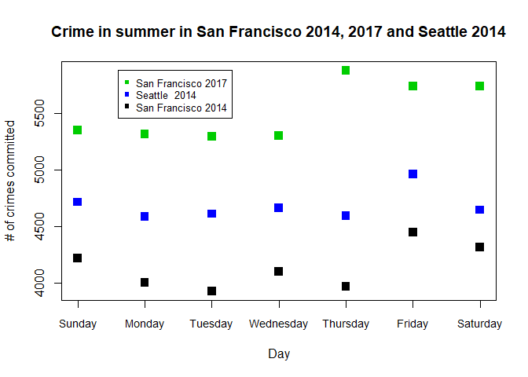
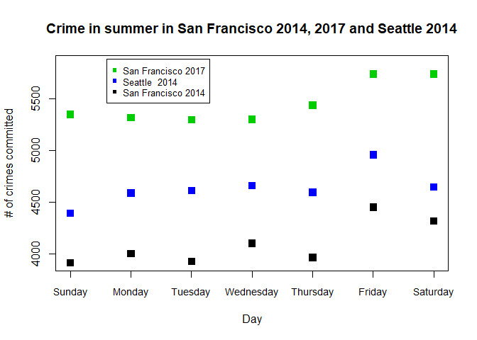
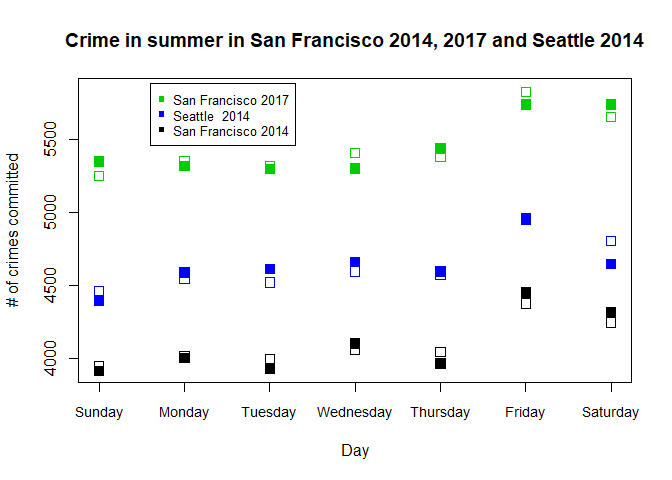
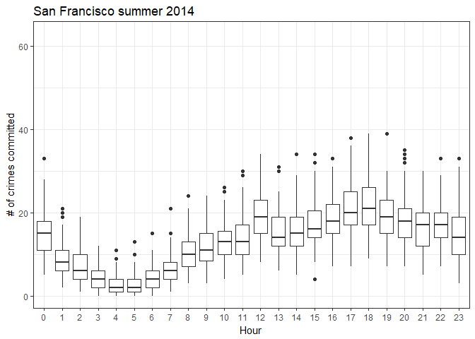
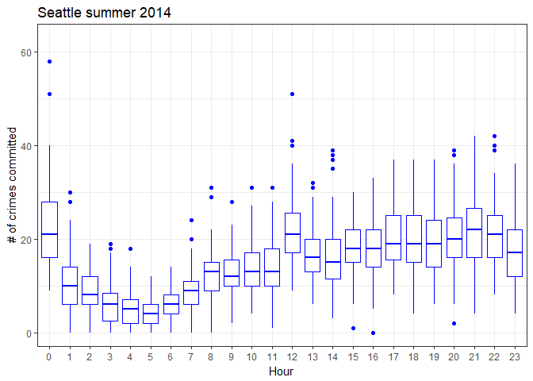
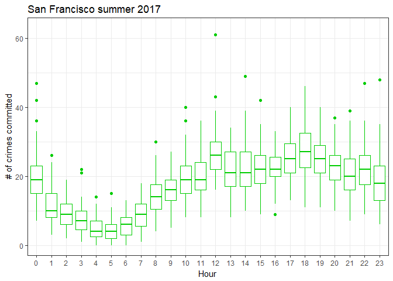
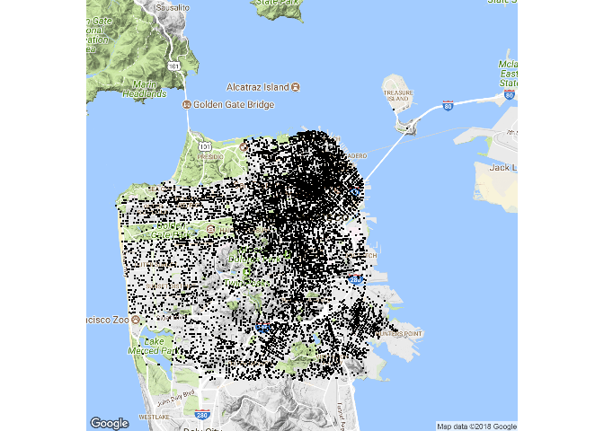
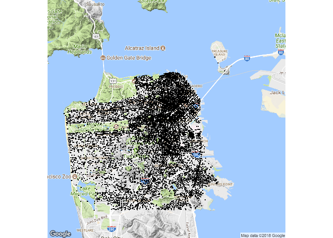
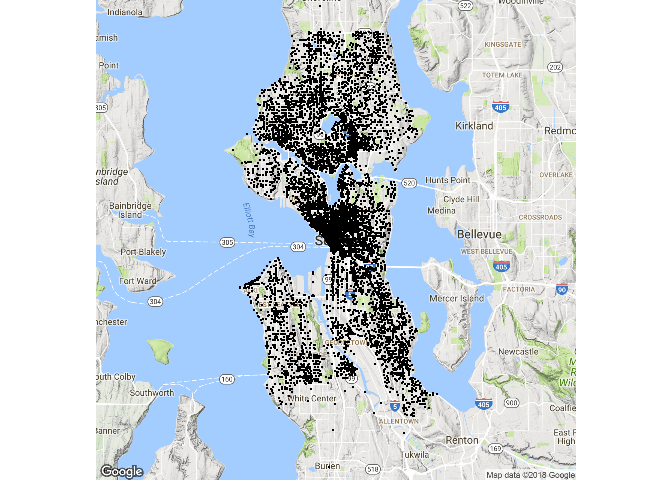

Data-Viz-Assignment
================
Ingrid Baade
April 16, 2018

Crime Analytics
---------------

Is the distribution of crimes over the days of the week in summer 2014 the same in San Francisco as it is in Seattle? Has that pattern of crimes over days of the week changed in San Francisco in summer 2017?

There are 92 days in summer which is 13 weeks plus one extra day. In 2014 the first day of June and the last day of August were Sundays, whereas in 2017 the first of June and 31st of August were Thursdays. I'm going to remove either the 1st June or the 31st August from the data because it looks like the extra day is adding to the day total, on Sunday in 2014 and Thursday in 2017. While at this stage I have no plan to compare months, I will take the day off the end of August so June doesn't go down to being a 29 day month.

We can now see a roughly consistent pattern for the three City-Year combinations, with the most crime occurring on a Friday. We can perform a Chi square test of association to see if the pattern of crime over days of the week is the same for all three City-Year combinations.

    ## 
    ##  Pearson's Chi-squared test
    ## 
    ## data:  table(CrimeTibble$DayOfWeek, CrimeTibble$CityYear)
    ## X-squared = 22.526, df = 12, p-value = 0.03203

To see where there might be some association between pattern over days for different city-years, we can plot the expected values, shown in the plot below with open squares. If there is no association between days and city-year combinations, the observed values would equal the expected values.

We could conclude that in comparison to San Francisco 2014 and 2017, Seattle has less crime on Saturdays than is expected if there is no association between the pattern over the days of the week and the city year combinations. Similarly crime on Wednesdays in San Francisco 2017 is less than would be expected if there is no association.

I'm going to have a look at the pattern of crime over the 24 hour period in summer in San Francisco 2014 and 2017 and Seattle 2014. I could go back to using the whole 92 days, but I'm going to keep using the 1st June to 30 August data. Then I won't have to worry the extra Sunday or Thursday is having an effect.

All three plots have peaks at 0, (the midnight hour), and 12, (midday). This could be for a number of reasons, but probably not because there is an increase in crime at these times.

I'm not going to do a Chi square test on this data because of the unusual peaks. The scale for all three plots is the same and it can be seen that in 2014 there is more crime in Seattle than in San Francisco and crime in San Francisco increases between 2014 and 2017.

I'll complete this assignment by showing some maps with the location of the crimes marked on. I've been wanting to try using maps in R for a while. Bit disappointing that "zoom" is restricted to a whole number. I decided to use a different zoom for Seattle and San Francisco. Undoubtably many of the locations of the crimes are duplicated, but San Francisco 2017 does look like it has a greater density of points compared to San Francisco 2014.

    ## Map from URL : http://maps.googleapis.com/maps/api/staticmap?center=san+francisco&zoom=12&size=640x640&scale=2&maptype=terrain&language=en-EN&sensor=false

    ## Information from URL : http://maps.googleapis.com/maps/api/geocode/json?address=san%20francisco&sensor=false

    ## Warning: `panel.margin` is deprecated. Please use `panel.spacing` property
    ## instead

    ## Map from URL : http://maps.googleapis.com/maps/api/staticmap?center=seattle&zoom=11&size=640x640&scale=2&maptype=terrain&language=en-EN&sensor=false

    ## Information from URL : http://maps.googleapis.com/maps/api/geocode/json?address=seattle&sensor=false

    ## Warning: `panel.margin` is deprecated. Please use `panel.spacing` property
    ## instead

    ## Warning: Removed 1945 rows containing missing values (geom_point).

Follow up work would include finding out why 1945 rows in the Seattle data have no latitude and longtitude. It would also be interesting to find out which types of crimes are allocated to "midday" and "midnight".
